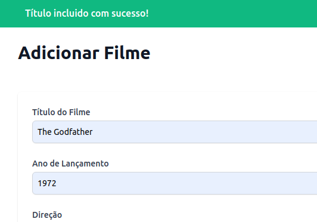

# Catálogo de BluRays/DVD's

> Aplicativo para ajudar cinéfilos a organizar seus BluRays e DVD's.

A aplicação permite cadastrar títulos de filmes, filtrar títulos por quem o dirigiu, e por nome digitado no campo de busca.
As informações dos títulos são armazenadas e obtidas pela API própria. Esta desenvolvida com o framework [Ruby On Rails](https://rubyonrails.org/).





## Pré-requisitos

- Ter [Ruby On Rails](https://gorails.com/setup/ubuntu/20.04#ruby-rbenv) instalado.
- Ter [NodeJS](https://nodejs.org/en/) instalado.
- Ter o pacote [Concurrently](https://www.npmjs.com/package/concurrently) instalado globalmente.

```bash
# Instalar Concurrently globalmente
npm install -g concurrently

```

## Instalação

```bash
git clone https://github.com/felipesvianna/bluray-app-app

```

## Utilização

```bash
npm start
```

Acessar http://localhost:3001

## Tecnologias utilizadas

- [ReactJS](https://reactjs.org/)
- [Tailwind CSS](https://tailwindcss.com/)
- [Ruby On Rails](https://rubyonrails.org/)

Mais informações no Readme dos diretórios [api/](https://github.com/felipesvianna/bluray-app-app/tree/master/api#cat%C3%A1logo-de-bluraysdvds---api) e [frontend/](https://github.com/felipesvianna/bluray-app-app/tree/master/frontend#cat%C3%A1logo-de-bluraysdvds---frontend).

## Autor

- **Felipe Vianna** - [Github](https://github.com/felipesvianna)

